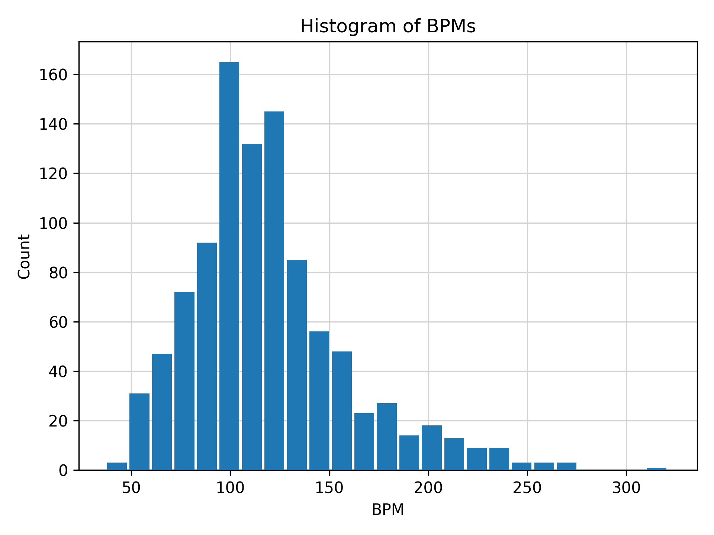
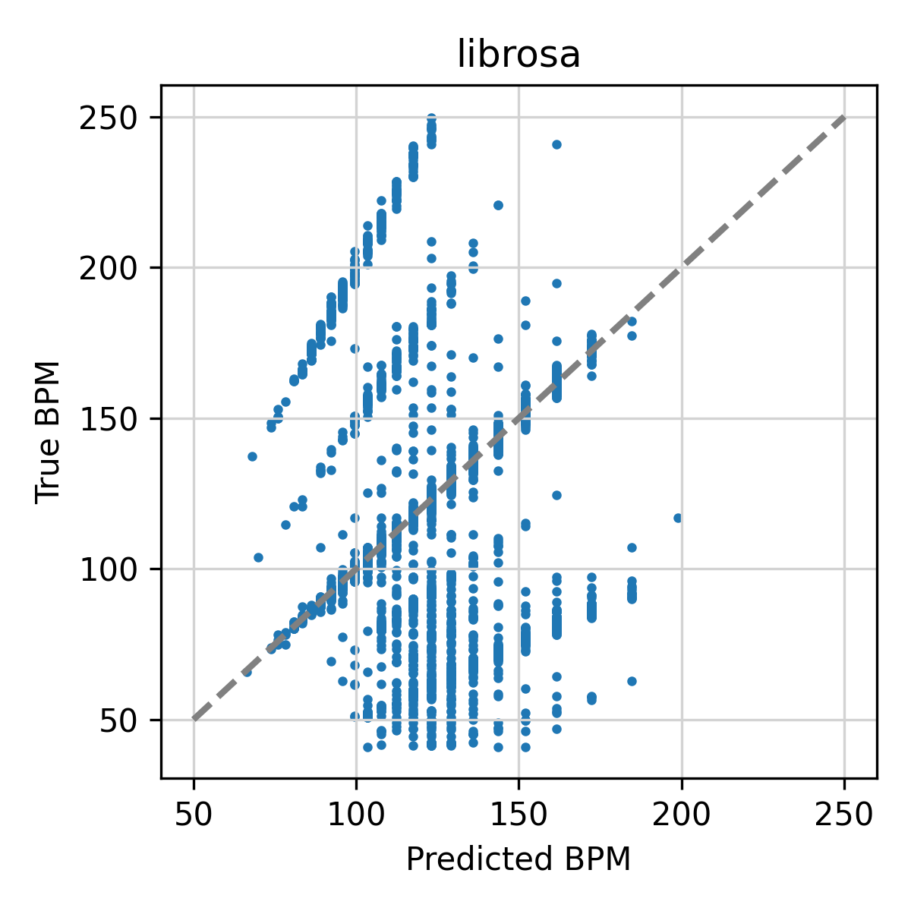
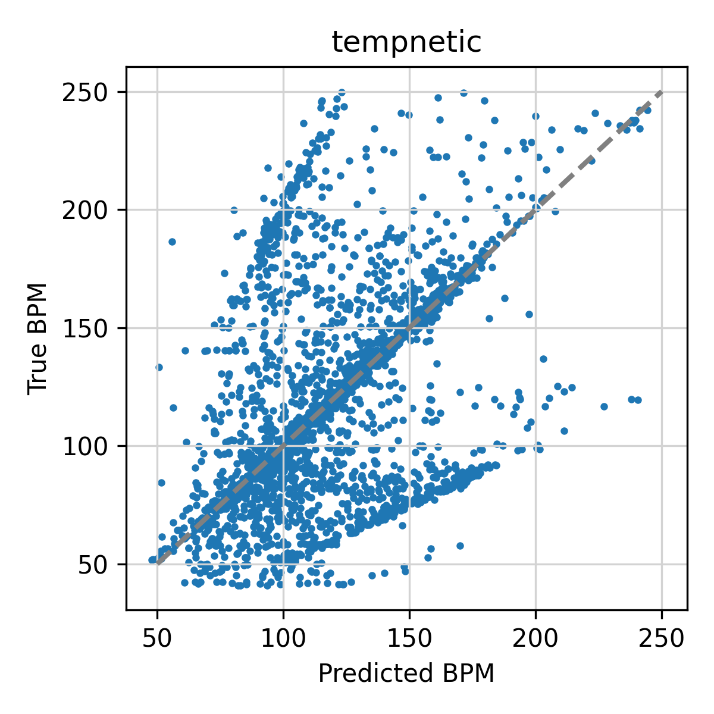

# tempnetic
Tempo estimation

## Installation

Install the package in editable mode in virtual environment.
```
python -m venv env
source env/bin/activate
pip install jsonargparse[signatures]>=4.18.0
pip install -e .
```

## Inference

Estimate global tempo for a song:

```
python scripts/run.py ./GTZAN/audio/country/country.00013.wav
# Estimated tempo: 127.13 BPM
```

## Training
Launch training on GPU by passing the trainer, 
```
CUDA_VISIBLE_DEVICES=5 python scripts/main.py fit \
-c cfg/trainer.yaml \
-c cfg/models/mobilenet.yaml \
-c cfg/data.yaml
```


# Overview

We are tasked with estimating the global tempo of a song. For training data, we are given the GTZAN dataset. 
This dataset contains 1000 songs, each 30 seconds long. Each song is annotated with the global tempo in BPM. 
We are also given beat annotations. There are a few different ways we could choose to frame this problem. 
First, we could choose to estimate the global tempo directly. This could be done either as a regression or classification problem.
In the case of regression we would estimate a floating point value corresponding to the tempo. In the case of classification, we would
discretize the tempo into a fixed number of bins. 
Second, we could choose to first estimate the beats and then use the beats to estimate the tempo.
This would provide greater flexibility in the case of tempo changes. However, it would also introduce more complexity into the model.
It may also provide additional benefit, since the beat tracker could be used for other tasks. 

## Dataset

It is important that we understand a bit more about the dataset before training our model. 
We know that GTZAN provides 1000 songs, each 30 seconds long. We also know that each song is annotated with the global tempo in BPM.
There are 10 different genres in the dataset, each with 100 songs. The genres are: blues, classical, country, disco, hiphop, jazz, metal, pop, reggae, rock.
The audio data is provided as WAV files with a sample rate of 22050 Hz. The tempo annotations are provided as text files with one tempo value per line.

One potential challenge we might face is that the dataset is not balanced with respect to tempo.
We can see this by plotting the distribution of tempos in the dataset.



Based on this, we would expect the model to perform better on songs with tempos between 100 and 130 BPM.
We even see some significant outliers below 50 BPM and above 250 BPM. We will need to keep this in mind when evaluating the model.
There are a few ways we could address this. First, we could do nothing and train with the current distribution.
Second, we could try to balance the dataset by sampling equally from each tempo bin.
Third, we could try to balance the dataset by applying time stretching dynamically while training to ensure a 
uniform distribution of tempos.
Based on the popular library madmom, we filter the dataset to only include songs with tempos between 40 and 250 BPM.
In addition, we need to check for potential issues in the audio. 
We check for missing files and corrupted files. We found that one wav file was corrupted (jazz.00054) and one bpm file was missing (reggae.00086). 
These checks are in the dataloader, so they are filtered before performing the dataset splits. 

We make a training and validation split based on genre. We use 80% of the songs for training and 20% for validation within each genre. 
We create training examples by splitting the audio files into non-overlapping chunks of 11 seconds (262144 samples @ f_s=22050).
We also consider adding some data augmentation to the pipeline. For now, we focus only on random gain augmentation. 
We could also include time stretching, however, we found this was slowing down training, so we opted to leave it out for now.

## Model

There are a number of important considerations for our model choice. We should think ahead to deployement. 
We can summarize the main aspects as: input, performance, parameter count, runtime, causality, and real-time operation.

We start by opting to use a model that operates on melspectrograms, which is a standard approach. 
From some initial testing, we found that this model did not perform well given the dataset (val accuracy ~ 0.68).
This performance was worse than our baseline, which is the librosa tempo estimation method (val accuracy ~ 0.71).
Based on this, we decided to try a different approach. 
In this case, we consider using the tempogram as input to the model. 
The tempogram is a representation based on the autocorrelation of the onset strength envelope.

We always would like the best performing model. 
However, one challenge is always in detereming *how* to evaluate the model in a way that aligns with our goals. 
This should most importanly consider generalization performance. 
In this case, that means how well does the model perform when estimating the tempo of real songs, likely songs that are uploaded by users or coming from the real-world distribution, which may not be captured by our dataset.

The model may run either on a remote server or on a mobile device. In both cases, reducing the compute required will be beneficial. However, we should consider the number of model parameters as well, since when deploying on mobile we aim to keep the final app size as small as possible. This is less of a concern on the remote server, however, if we can use CPU instances instead of GPU, this will significantly reduce the cost of running the model.
To keep things simple, we consider two different CNN architectures. The first is a large model based on PANNs. The second is a small model based on MobileNetV2.

If real-time operation is required, we will need to consider if the model is causal or not. For a causal model, or nearly causal model, the amount of lookahead must be limited to ensure real-time operation. In this case, we will need to consider the tradeoff between performance and causality. Since we are aiming to estimate the global tempo, we can liekly afford to have lookahead. For this reason, we opt for a noncausal model where the CNN can look at the entire signal when making a prediction. 
We could adjust this though by using a causal convolutional layer, which would limit the amount of lookahead.

## Training

Since we opt to estimate the tempo directly, we will use a regression model.
As described in the previous section, we will use the model to estimate the tempo as a scalar floating point value.
For training, we will then use the mean squared error (MSE). To help make training more stable, we will normalize the ground truth tempo values between 0 and 1. Then we can apply a sigmoid activation to the output of the model to get a value between 0 and 1. To do this, we will set a min and max tempo value. After analysis of the dataset we will set min to 40 BPM and max to 250 BPM to ensure no out of range values. 
We also use the AdamW optimizer, which is a variant of Adam that uses weight decay.

## Evaluation

As mentioned above, we evaluate our model compared to the librosa tempo estimation method.
Following the common evaluation practice in MIREX and popular libraries like madmom, we use the accuracy metric. 
Accuracy is defined as the percentage of predictions that are within 8% of the ground truth tempo.
Using the `eval.py` script, we can evaluate the model on the validation set.
We also make a plot of the predictions vs ground truth tempo in an XY plot.





## Inference

We should also consider how we handle making predictions for songs that are both shorter and longer than the training block size of 11 seconds. 

## Project

The project is implemented as a python package. We use PyTorch and PyTorch Lightning for the model and training.
For model configuration we the LightningCLI, which allow us to use yaml files to configure the model and training.

- `cfg`: LightningCLI configuration files
- `scripts`: Scripts for training and evaluation
    - `main.py`: Main script for training and evaluation
    - `eval.py`: Standalone script for evaluation (librosa baseline and model)
    - `explore.py`: Standalone script for data exploration
- `tempnetic`: Python package
    - `utils.py`: Utility functions
    - `models`: PyTorch models
        - `mobilenet.py`: MobileNetV2 model
        - `panns.py`: PANNs model
    - `data.py`: PyTorch dataset and LightningDataModule
    - `callbacks.py`: Lightning callbacks
- `tests`: Simple tests


## Brainstorming

- What if the tempo changes during the song?
- Should we estimate beats first and use beats to compute tempo?
- If we estimate the tempo directly, should we treat as classification or regression problem?
    - For regression, we can use MSE loss.
    - However, range will be between ~50-300 BPM, so we will need to normalize the data.
    - We normalize the targets to be between 0 and 1 and use sigmoid activation.
- Any problems with the dataset?
    - There are some missing and corrupted files.
    - Should we listen to the audio?
- Should we add data augmentation due to small dataset size? 
    - We need to do some data exploration to see if the dataset is balanced or not.
    - What is the distribution of tempos in the dataset?
    - What is the min and max tempo in the dataset?
- If we use data augmentation, what kind of augmentation should we use?
- Are there any non-neural network methods that we can use as a baseline?
    - Looks like librosa has a method based on onset detection.

- We will want a train/test split? 
- What sample rate? 
- Deployment? Can we compile to torchscript or run in CoreML?

Dataset: 
- We will use the GTZAN dataset
- We will use input of 262144 samples (~11 seconds)
- Use 22050 Hz sample rate
- We will use the tempo annotations from the dataset

Model design:
- Input: spectrogram
- Output: tempo? beats? 
- Types of models
    - 2d CNN
    - LSTM
    - Transformer
    - Mamba (SSM)
- Let's opt for two CNNs
    - PANNs (large model)
    - MobileNetV2 (small model that can run on CPU)
- Can we use features from a pre-trained model?

Considerations:
- Performance (how do we measure this?)
- Generalization (does it work on real songs?)
- Efficiency (can we run it on CPU?)
- Causality and real-time operation


## Resources

- [Tempo Estimation @ MIREX](https://www.music-ir.org/mirex/wiki/2014:Audio_Tempo_Estimation)
- [Librosa Tempo Estimation](https://librosa.org/doc/main/generated/librosa.feature.tempo.html)
- [Librosa Tempogram](https://librosa.org/doc/main/generated/librosa.feature.tempogram.html)